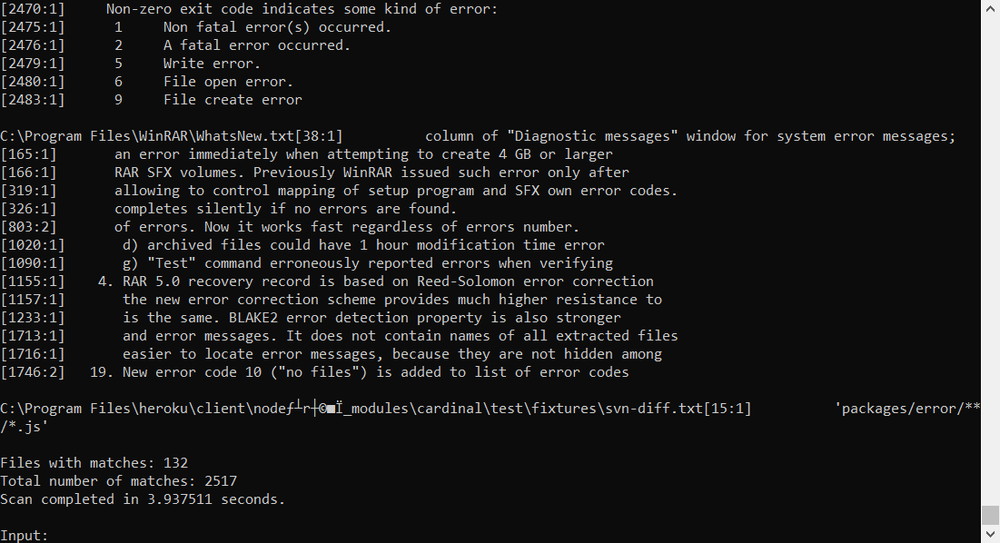

# LANScan
Multithreaded console application that allows the user to scan a server's filesystem for a given expression contained within a file over a LAN network.

## Usage

### Server
```
Start the server: LANScanServer.exe [ip]
```

### Client
```
Start the client: LANScanClient.exe [ip]
Connect to the server: connect [ip]
Disconnect from the server: drop
Disconnect from and stop the server: stopserver
Scan the server's files for an expression: scan [-v] path expression [extension-list]*
```


